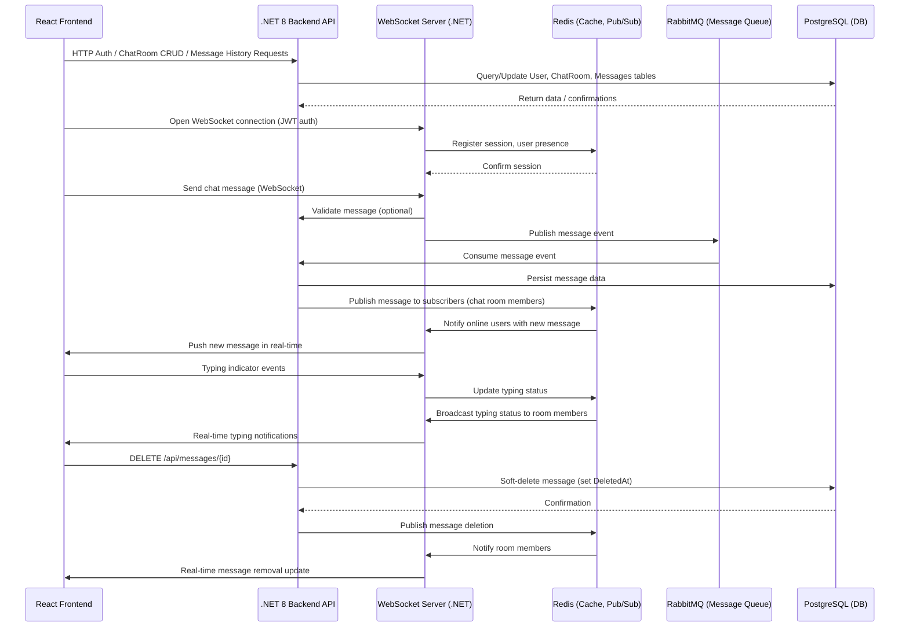
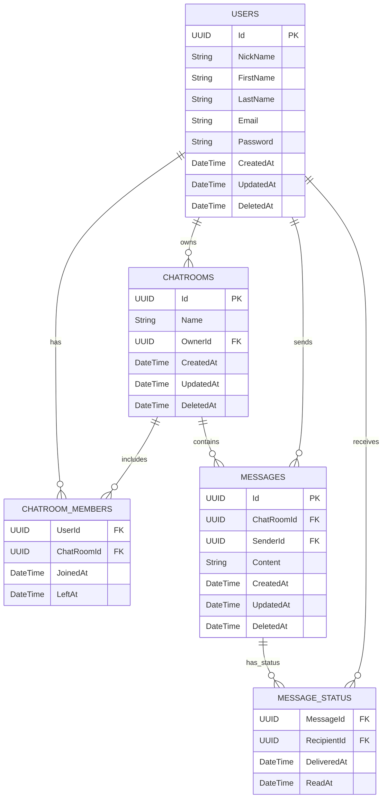

# 📘 Chat Manager – Product Requirements & System Design

## 🧠 Overview

**Stack**: React + .NET 8 + Redis + WebSocket + PostgreSQL + RabbitMQ + MediatR + OpenAPI (Swagger)  
**Purpose**: Create a real-time chat platform where users can:
- Register and log in
- Create and delete chat rooms
- Invite other users to chat rooms
- Exchange text messages in real time
- Delete their own messages

---

## 📦 Functional Requirements

### 🔐 User Management
- Register/Login with JWT
- Invite users by email or username
- All actions require authentication

### 💬 Chat Room Management
- Create, list, get, and delete owned chat rooms
- Invite users to chat rooms

### 💭 Messaging
- Send/receive text messages via WebSocket
- Paginated chat history via REST
- Track message status: delivered, read
- Users can delete their own messages in chat rooms (soft delete)

---

## 📡 API Routes

### User Routes

| Method | Route             | Description         |
|--------|-------------------|---------------------|
| POST   | /api/users        | Create user         |
| GET    | /api/users/{id}   | Get user by ID      |
| DELETE | /api/users/{id}   | Delete user by ID   |
| POST   | /api/users/login  | Authenticate user and return JWT   |

### Chat Room Routes

| Method | Route                        | Description               |
|--------|------------------------------|---------------------------|
| POST   | /api/chatrooms               | Create chat room          |
| GET    | /api/chatrooms               | List user chat rooms      |
| GET    | /api/chatrooms/{id}         | Get chat room details     |
| DELETE | /api/chatrooms/{id}         | Delete owned chat room    |
| POST   | /api/chatrooms/{id}/invite  | Invite user to chat room  |

### Message Routes

| Method | Route                                  | Description                            |
|--------|-----------------------------------------|----------------------------------------|
| GET    | /api/chatrooms/{roomId}/messages       | Get paginated message history          |
| DELETE | /api/messages/{messageId}              | Delete own message (soft delete)       |

---

## 🧰 Tools & Libraries

### Backend
- **.NET 8** – Main backend platform
- **MediatR** – CQRS and clean architecture
- **Entity Framework Core** – ORM for PostgreSQL
- **Redis** – Session management, pub/sub, typing indicators
- **RabbitMQ** – Asynchronous event/message queue
- **SignalR/WebSocket** – Real-time messaging
- **OpenAPI (Swagger)** – API documentation

### Frontend
- **React** – UI framework
- **Axios/Fetch** – API client
- **WebSocket/Socket.IO** – Real-time communication

---

## 🔄 System Interaction Diagram



---

## 🧱 ERD – Entity Relationship Diagram



---

## 💡 Message Operations – Detailed Behavior

### ✉️ Sending Messages

**Action**: User sends a message via WebSocket.  
**Requirements**:
- Only authenticated users can send messages.
- User must be a member of the chat room.

**Flow**:
1. Client sends message payload over WebSocket: `{ chatRoomId, content }`
2. WebSocket server validates JWT and user membership in the room.
3. Message is published to RabbitMQ for async persistence.
4. Backend consumes the event, stores the message in PostgreSQL, and emits a notification via Redis pub/sub.
5. WebSocket server broadcasts the message to all connected users in the chat room.

**Message Object Structure**:
```json
{
  "id": "uuid",
  "chatRoomId": "uuid",
  "senderId": "uuid",
  "content": "Hello",
  "createdAt": "2025-08-05T14:12:00Z",
  "status": {
    "deliveredAt": "...",
    "readAt": "..."
  }
}
```

---

### 🗑️ Deleting Messages

**Action**: A user deletes their own previously sent message.  
**Requirements**:
- Users can only delete messages they have sent.
- Deletion is soft (only sets `DeletedAt` timestamp).
- Deleted messages should be excluded from default fetch responses and real-time displays.

**API Route**:
```
DELETE /api/messages/{messageId}
```

**Flow**:
1. Client makes HTTP DELETE request with JWT token.
2. API validates ownership of the message.
3. Message row is soft-deleted by setting `DeletedAt`.
4. Redis pub/sub emits a `message-deleted` event.
5. WebSocket server pushes a deletion event to all online members in the chat room.

**Real-Time Deletion Broadcast Example**:
```json
{
  "type": "message_deleted",
  "messageId": "uuid",
  "chatRoomId": "uuid"
}
```

---

### 📜 Fetching Message History

**Action**: A user fetches historical messages for a specific chat room.  
**Requirements**:
- Must be authenticated and a member of the room.
- Deleted messages (with `DeletedAt` not null) must be excluded.
- Supports pagination.

**API Route**:
```
GET /api/chatrooms/{roomId}/messages?page=1&pageSize=50
```

**Flow**:
1. Client calls REST endpoint with JWT.
2. Backend validates user membership.
3. Messages are queried, ordered by `CreatedAt DESC`, excluding rows where `DeletedAt` is not null.
4. Messages are returned in pages.

**Response Example**:
```json
{
  "page": 1,
  "pageSize": 50,
  "total": 152,
  "messages": [
    {
      "id": "uuid",
      "senderId": "uuid",
      "content": "Hi there!",
      "createdAt": "2025-08-05T13:00:00Z"
    }
  ]
}
```

---

## 🚀 Development Timeline (Phase 1)

| Week | Milestone                                  |
|------|---------------------------------------------|
| 1    | Infra, auth, basic user endpoints           |
| 2    | Chat room creation, invite, delete          |
| 3    | WebSocket server setup                      |
| 4    | RabbitMQ integration + message persistence  |
| 5    | React UI (chat, room listing, auth)         |
| 6    | Final testing, Swagger docs, deployment     |
|      | (Optional): Message deletion + real-time sync |
