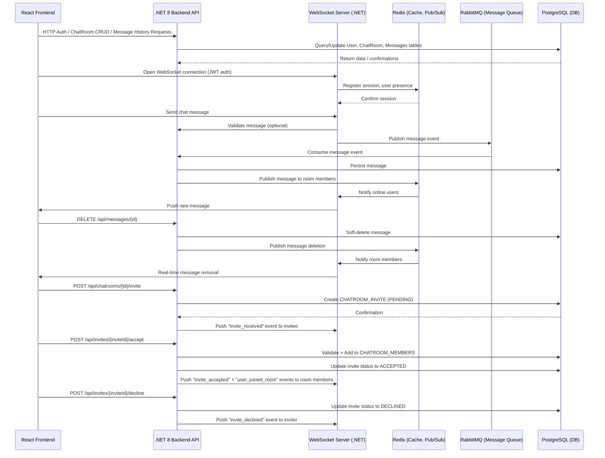
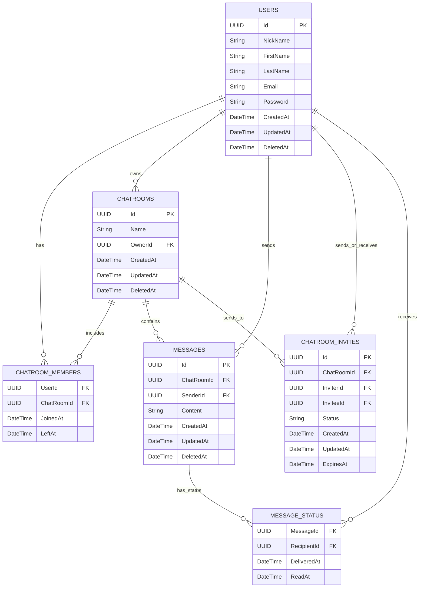

# 📘 Chat Manager – Product Requirements & System Design

## 🧠 Overview

**Stack**: React + .NET 8 + Redis + WebSocket + PostgreSQL + RabbitMQ + MediatR + OpenAPI (Swagger)  
**Purpose**: Create a real-time chat platform where users can:
- Register and log in
- Create and delete chat rooms
- Invite other users to chat rooms
- Exchange text messages in real time
- Delete their own messages

---

## 📦 Functional Requirements

### 🔐 User Management
- Register/Login with JWT
- Invite other registered users by their account ID
- Accept or decline invitations
- All actions require authentication

### 💬 Chat Room Management
- Create, list, get, and delete owned chat rooms
- Invite registered users to chat rooms
- Track invitation status (pending, accepted, declined, expired)

### 💭 Messaging
- Send/receive text messages via WebSocket
- Paginated chat history via REST
- Track message status: delivered, read
- Users can delete their own messages in chat rooms (soft delete)

---

## 📡 API Routes

### User Routes

| Method | Route             | Description         |
|--------|-------------------|---------------------|
| POST   | /api/users        | Create user         |
| GET    | /api/users/{id}   | Get user by ID      |
| DELETE | /api/users/{id}   | Delete user by ID   |
| POST   | /api/users/login  | Authenticate user and return JWT |

### Chat Room Routes

| Method | Route                        | Description               |
|--------|------------------------------|---------------------------|
| POST   | /api/chatrooms               | Create chat room          |
| GET    | /api/chatrooms               | List user chat rooms      |
| GET    | /api/chatrooms/{id}         | Get chat room details     |
| DELETE | /api/chatrooms/{id}         | Delete owned chat room    |
| POST   | /api/chatrooms/{id}/invite  | Invite a registered user to chat room |
| GET    | /api/chatrooms/{id}/invites | List pending invites for a chat room (owner only) |

### Invitation Routes

| Method | Route                                   | Description |
|--------|-----------------------------------------|-------------|
| GET    | /api/users/me/invites                   | List my pending invites |
| POST   | /api/invites/{inviteId}/accept          | Accept invitation |
| POST   | /api/invites/{inviteId}/decline         | Decline invitation |
| DELETE | /api/invites/{inviteId}                 | Cancel invitation (owner only) |

### Message Routes

| Method | Route                                  | Description                            |
|--------|-----------------------------------------|----------------------------------------|
| GET    | /api/chatrooms/{roomId}/messages       | Get paginated message history          |
| DELETE | /api/messages/{messageId}              | Delete own message (soft delete)       |

---

## 🧰 Tools & Libraries

### Backend
- **.NET 8** – Main backend platform
- **MediatR** – CQRS and clean architecture
- **Entity Framework Core** – ORM for PostgreSQL
- **Redis** – Session management, pub/sub, typing indicators
- **RabbitMQ** – Asynchronous event/message queue
- **SignalR/WebSocket** – Real-time messaging
- **OpenAPI (Swagger)** – API documentation

### Frontend
- **React** – UI framework
- **Axios/Fetch** – API client
- **WebSocket/Socket.IO** – Real-time communication

---

## 🔄 System Interaction Diagram



---

## 🧱 ERD – Entity Relationship Diagram



---

## 💡 Message Operations – Detailed Behavior

### ✉️ Sending Messages

**Action**: User sends a message via WebSocket.  
**Requirements**:
- Only authenticated users can send messages.
- User must be a member of the chat room.

**Flow**:
1. Client sends message payload over WebSocket: `{ chatRoomId, content }`
2. WebSocket server validates JWT and user membership in the room.
3. Message is published to RabbitMQ for async persistence.
4. Backend consumes the event, stores the message in PostgreSQL, and emits a notification via Redis pub/sub.
5. WebSocket server broadcasts the message to all connected users in the chat room.

**Message Object Structure**:
```json
{
  "id": "uuid",
  "chatRoomId": "uuid",
  "senderId": "uuid",
  "content": "Hello",
  "createdAt": "2025-08-05T14:12:00Z",
  "status": {
    "deliveredAt": "...",
    "readAt": "..."
  }
}
```

---

### 🗑️ Deleting Messages

**Action**: A user deletes their own previously sent message.  
**Requirements**:
- Users can only delete messages they have sent.
- Deletion is soft (only sets `DeletedAt` timestamp).
- Deleted messages should be excluded from default fetch responses and real-time displays.

**API Route**:
```
DELETE /api/messages/{messageId}
```

**Flow**:
1. Client makes HTTP DELETE request with JWT token.
2. API validates ownership of the message.
3. Message row is soft-deleted by setting `DeletedAt`.
4. Redis pub/sub emits a `message-deleted` event.
5. WebSocket server pushes a deletion event to all online members in the chat room.

**Real-Time Deletion Broadcast Example**:
```json
{
  "type": "message_deleted",
  "messageId": "uuid",
  "chatRoomId": "uuid"
}
```

---

### 📜 Fetching Message History

**Action**: A user fetches historical messages for a specific chat room.  
**Requirements**:
- Must be authenticated and a member of the room.
- Deleted messages (with `DeletedAt` not null) must be excluded.
- Supports pagination.

**API Route**:
```
GET /api/chatrooms/{roomId}/messages?page=1&pageSize=50
```

**Flow**:
1. Client calls REST endpoint with JWT.
2. Backend validates user membership.
3. Messages are queried, ordered by `CreatedAt DESC`, excluding rows where `DeletedAt` is not null.
4. Messages are returned in pages.

**Response Example**:
```json
{
  "page": 1,
  "pageSize": 50,
  "total": 152,
  "messages": [
    {
      "id": "uuid",
      "senderId": "uuid",
      "content": "Hi there!",
      "createdAt": "2025-08-05T13:00:00Z"
    }
  ]
}
```

## 📩 Chat Room Invitations – Detailed Behavior

### **Sending Invitations**
1. Owner sends:
```json
POST /api/chatrooms/{id}/invite
{
  "inviteeId": "uuid"
}
```
2. API validates:
   - Requester is the owner of the chat room.
   - Invitee exists in `USERS`.
   - Invitee is not already a member.
   - No existing pending invite for this user & room.
3. Creates `CHATROOM_INVITES` record with status `PENDING`.
4. Sends WebSocket event to invitee if online:
```json
{
  "type": "invite_received",
  "inviteId": "uuid",
  "chatRoomId": "uuid",
  "chatRoomName": "Team Chat",
  "inviterId": "uuid"
}
```

---

### **Accepting Invitations**
1. Invitee sends:
```
POST /api/invites/{inviteId}/accept
```
2. API validates:
   - Invite exists and is `PENDING`.
   - Invitee matches the authenticated user.
   - Invite has not expired.
3. Adds user to `CHATROOM_MEMBERS`.
4. Updates invite status to `ACCEPTED`.
5. Broadcasts:
   - To all room members: `user_joined_room`
   - To invitee: acceptance confirmation.

---

### **Declining Invitations**
1. Invitee sends:
```
POST /api/invites/{inviteId}/decline
```
2. API validates invite.
3. Sets invite status to `DECLINED`.
4. Sends WebSocket event to inviter: `invite_declined`.

---

### **Expiration**
- Invitations expire at `ExpiresAt` (default: 7 days).
- Expired invites cannot be accepted.
- Optional cleanup job removes expired invites.

---

### **WebSocket Events**
| Event Type          | Payload |
|---------------------|---------|
| `invite_received`   | `{ inviteId, chatRoomId, chatRoomName, inviterId }` |
| `invite_accepted`   | `{ inviteId, chatRoomId, userId }` |
| `invite_declined`   | `{ inviteId, chatRoomId, userId }` |
| `user_joined_room`  | `{ chatRoomId, userId }` |
---

## 🚀 Development Timeline (Phase 1 – Updated)

| Week | Milestone |
|------|-----------|
| **1** | **Infrastructure Setup**<br>• Project scaffolding (.NET 8 backend, React frontend)<br>• PostgreSQL, Redis, RabbitMQ containers<br>• Auth with JWT + basic `/api/users` CRUD<br>• Swagger/OpenAPI documentation enabled |
| **2** | **User & Chat Room Core**<br>• User registration/login flow complete<br>• Create, list, get, and delete chat rooms<br>• Owner validation and authentication middleware<br>• Initial DB migrations |
| **3** | **Invitation System**<br>• `CHATROOM_INVITES` table & entity<br>• API: Send invite (owner only), list pending invites<br>• WebSocket: `invite_received` event to invitee<br>• Basic frontend UI for viewing & sending invites |
| **4** | **Invitation Responses & Membership Updates**<br>• API: Accept/decline invites<br>• DB updates membership & invite status<br>• WebSocket: `invite_accepted`, `invite_declined`, `user_joined_room` events<br>• Frontend UI for accepting/declining invites |
| **5** | **Messaging Core**<br>• WebSocket server setup with SignalR<br>• Send/receive real-time messages<br>• RabbitMQ integration for async persistence<br>• Store messages in PostgreSQL<br>• Redis pub/sub for broadcasting |
| **6** | **Message History & Deletion**<br>• API: Paginated `GET /api/chatrooms/{id}/messages` excluding deleted<br>• API: Soft-delete message + WebSocket `message_deleted` event<br>• Frontend updates message list in real time |
| **7** | **Frontend Chat UI & Presence**<br>• Complete chat room UI with member list<br>• Real-time presence indicators via Redis<br>• Typing indicators (`typing_started`, `typing_stopped`) |
| **8** | **Final Testing & Deployment**<br>• End-to-end integration tests<br>• Security checks & rate limiting<br>• Production deployment scripts<br>• Post-launch monitoring setup |